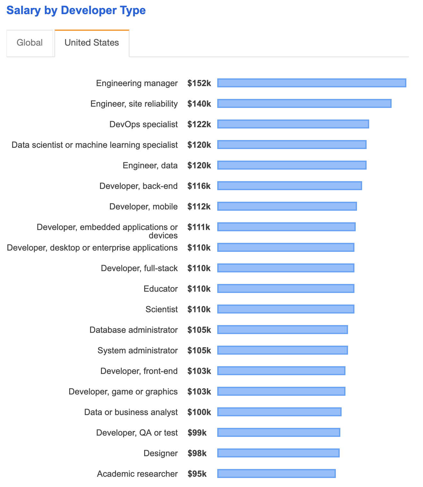
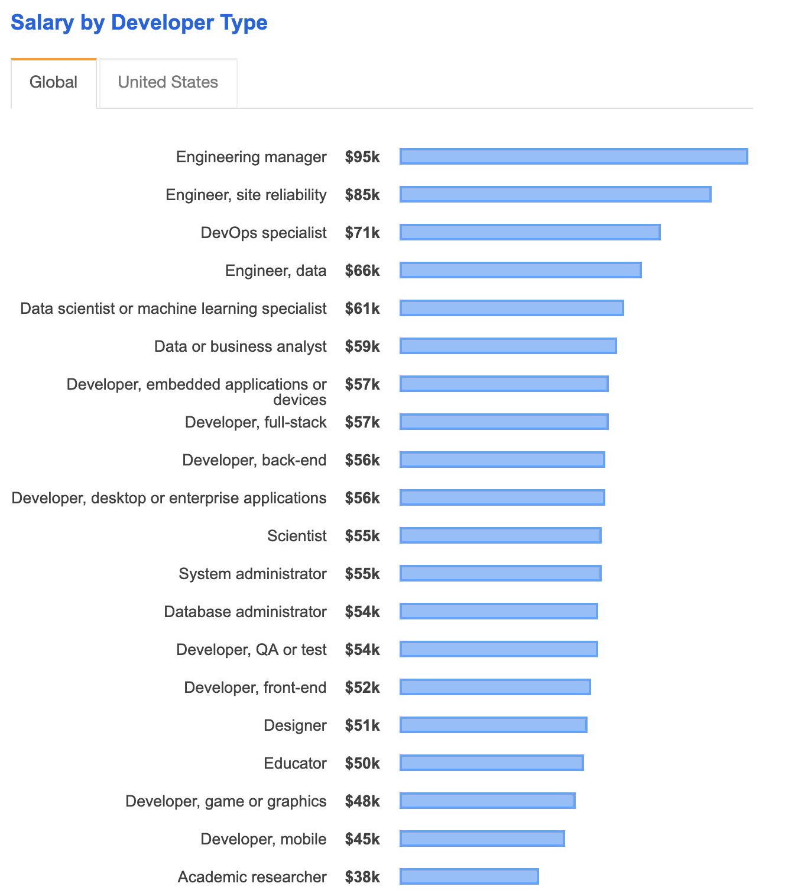

# Day 01 - What is Web Development

Let's look at what Web Development is and why you might be interested in learning more about it. 

I>**Web Developers** are also called **Programmers**, **Developers**, **Software Engineers**, **Coders**, and the list goes on.  The key to all of these nouns is that they describe someone who makes or builds web programs, web applications, and/or web pages.

##Can you become a Web Developer?

Assuming you have access to a computer, the internet, and the self-motivation to take learning into your own hands, I can confidently answer **Yes**.  Yes, you can become a Web Developer.

Learning about Web Development is not only for the hoodied introvert who overuses the word "algorithm."  Web Development is one of the few careers attainable via a self-taught curriculum, making itself available to a diverse range of people.  

According to Stack Overflow's 2019 Developer Survey Results, close to 37% of Professional Developers do *not* have an undergraduate degree in Computer Science[^stackoverfloweducation].  

Many developers, myself included, are self-taught, or have sought additional non-collegiate means to learn their skills; bootcamps, on the job training, etc.  Teaching yourself the skills to get hired as a Web Developer is very accessible, especially compared to a profession like nursing; no tricky questions about how to find a cadaver or willing friend for practice 😬.

It should also be noted that **learning about Web Development is not just for those that want to _be_ Web Developers**.  Learning the basics of Web Development is valuable to those working on the periphery of the software/computer world.  If you work for Software as a Service company “SaaS,” either in Sales, Customer Service, Quality Assurance, etc. there are a lot of tricks and tidbits about Web Development that we’ll cover in these 30 days that will improve your ability to do what you do.

## Should I become a Web Developer?

This is a personal question I can't answer, but I can give you potentially persuasive statistics.

T>A personal story`:` Post-graduate, I have worked as an Economist, a Barista, a Bartender, Personal Trainer, Event Manager, and now as Frontend Developer.  In my current position, I work remotely - from home 🏡 - and I absolutely love my job. I solve problems, I am challenged, and work with a diverse, smart group of co-workers.  Additionally, I know that as I grow my skills, my job prospects and job security rise correspondingly.

The field of Web Development is growing, and the demand is high.  According to the Bureau of Labor Statistics, Computer and IT occupations are the fastest growing of all US occupations[^BLS].  Additionally, there is a shortage of qualified people to fill those jobs.  A commonly cited statistic is, "that by 2020, there will be a 1.4 million computing jobs in 2020, with only 400,000 qualified developers to fill them[^devmtn]."  A little research shows this is likely a flawed assumption[^flawed], especially taking into consideration the growing international developer community.  That being said, the demand and jobs are there.

The **$$$** isn't bad either. Back to StackOverflow's Annual Developers Survey, we can see at the very least, a career in Web Development can pay in the six-figure range.

**United States**

**Global**

## How do I become a Web Developer?

I want to stress - because I was unsure when I first started my journey - you can learn how to become a Web Developer _and_ find a job in the field _on your own_.  You don't need a bootcamp, or university degree.  It will take work, self-discipline, and likely won't come without some costs, most notably opportunity costs. Meaning, you'll have to give up some things in your life to make way for the time commitment this will take.

A widely circulated illustration for what it takes to become a Web Developer can be found at the bottom of the W3School's[^w3s] page ["Web Development Roadmaps."](https://www.w3schools.com/whatis/)  I 💛 this field guide, but honestly I think it's better suited for those at say course level 201, not 101. On day 30 of this series, I will introduce a Field Guide better suited for very beginners; those who are considering signing up for a bootcamp, or are curious, but are not quite sure what it means when someone says "Learn the Basics."

In the next series of articles, we'll setup key tools we'll need in this journey.  The first being the browser's Developer Tools.

[^BLS]:https://www.bls.gov/ooh/computer-and-information-technology/home.htm
[^devmtn]:https://devmountain.com/guides/learn-web-development
[^flawed]:http://econdataus.com/claim400k.htm
[^stackoverfloweducation]:https://insights.stackoverflow.com/survey/2019#education
[^w3s]: W3School is a popular website for learning all things web development.