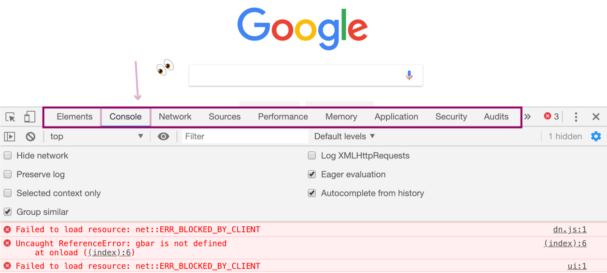

# Day 02 - 

---
coverImageBackgroundPosition: "50% 87%;"
---

# Day 02 - Developer Tools - Setup & Tooling

Now that we know what Web Development is and why want to learn more about it, let's get setup with some essential tooling.  This article is the first of three Setup & Tooling where I introduce you to and get you started with:

1. **Developer Tools**:  A tool used by developers to inspect and work on web pages.  It's a tool that comes packaged with your web browser.
2. **Operating System**: Understanding which one you have and what that means.
3. **Text Editor** A software tool used to aid in writing code.

## Developer Tools

Every modern browser comes with its own web developer tools (also called DevTools). These tools are used heavily by - you guessed it - Web Developers. DevTools aim to help developers test and debug their code. For us, they provide a great place to explore the concepts we will talk about.

A good chunk of our future exercises will require we use a web browser and developer tools.  We will be using the Chrome web browser, and subsequently the Chrome DevTools.

### Opening Chrome DevTools

1\. Navigate to any web page using the Chrome web browser.

There are several ways to open the DevTools, but I recommend using the keyboard shortcut method because it's the quickest and most convenient.    

With a web page open, hold `command + alt + j` (Windows Users: `ctrl + shift + j`).

Once you have the DevTools open you should see the following window pop-up.

A couple of things to note:

* By default you will land on the **Console** panel.  The Console is a panel in the DevTools where Chrome executes commands that you type there. The Console is not unique to Chrome.  All major browsers have one.  We will cover the Console in more detail in later articles.

* Everything inside the dark pink box is called a **panel**.  To the left of the Console panel, for example, is the **Elements** panel.

* The red errors I show on my Console panel may or may not show for you.  Errors like this are for Web Developers and are sent to the Console panel from the web page you are on.  For our purposes, we can ignore them.

2\. Let's navigate over to the Elements panel. Click on the Elements panel (just to the left of the Console panel).

The Elements panel shows the web page as "code".  A good way to visual what the Elements panel does is to think of the web page as a stitching.  The Elements panel would then be the backside of the stitches; they're one and the same, one is just prettier.

3\. To help demonstrate how the DevTools can be useful we are going to change the color and text of something on a web page.  For this example, we are going to use the very first website ever created.  

Built in 1991 by CERN, it’s rather incredible that this first website is still visible and usable today. This is possible because the first website was built in HTML, and HTML continues to be the foundational language of all content on the web; a topic we will dive into more in a future exercise.

**Open the first website** in your Chrome browser by clicking on the [link here](http://info.cern.ch/hypertext/WWW/TheProject.html).

4\. Open the DevTools and navigate to the Elements panel.

Under the Element’s section is the HTML of the web page.  We will be playing with the heading element.

Click on the `<h1></h1>` Element.  This is the Element that makes the header of the web page read "**World Wide Web**".

I>We talk more about **Elements** and **Tags** in an upcoming article. For now, it's enough to know they are they represent the structure of the web page.

5\. Now, double-click on the `World Wide Web` text, and change the text from "World Wide Web" to "Your First Website."  To see the change take effect, click outside of the Elements panel.

Now look at the web page and see that the text inside the `<h1></h1>` element has changed.

It's worth stopping for a moment, and appreciating what you just did: you modified a web page!  This is a good use case for the mind blow 🤯 emoji.   

I>Making changes in the DevTools doesn't modify the actual HTML.  You are only modifying what your browser is displaying.  In other words, you won't break anything.  If you refresh the page, all your changes go away.

A browser's developer tools does way more than just allow you to make text changes.  You can modify colors, layout, run code, and see details of how the web page is loading.  Learning how to navigate and use the DevTools will be an essential skill that you will pickup on your way to becoming a Web Developer.  I've only introduced you to it, but we'll revisit it in later exercises and hopefully you start exploring some of it's functionality on your own. 

Tomorrow we'll learn more about operating systems, and why understanding some of their key concepts will help you understand the foundations of web development.

