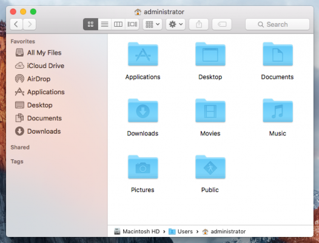
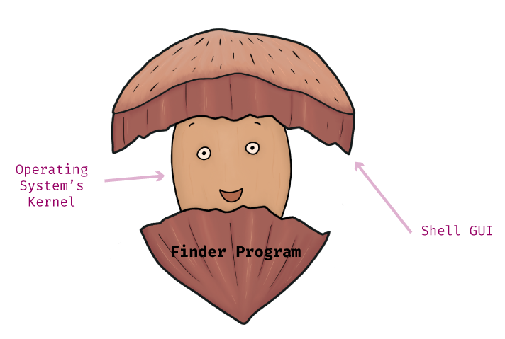

---
coverImageBackgroundPosition: "50% 87%;"
---

# Day 04 - GUIs and Shells

Continuing our Operating System discussion from yesterday, we now understand generally what Operating Systems do.  There are some more convoluted differences between the different types of Operating System, but the one we are concerned with is the GUI and Shell.  Two terms we will introduce and talk about today.

### GUI's

Though you may not know it, you’re very familiar with GUI’s. These are programs designed to make it easy for the everyday computer user to do things with their computer. They use graphics, icons, and menus to make navigation and executing commands easy.

An example of a popular GUI is the Finder program, see the following screenshot.  The equivalent program in Windows is “File Explorer.”

MacOS and Windows OS have slightly different ways of organizing and presenting files. Functionally, these differences will not matter to us. However, if you find any of the examples difficult because you are using a different Operating System, please reach out to us for assistance.

## Shell and the Kernel

Shell and Kernels are about as deep as we need our learning of Operating Systems to go for now.  However, understanding even on a basic level, these two terms will clarify _how_ you can work with an Operating System; something you'll be doing as a Web Developer.

A **Shell** is an interface that gives you access to your computer’s Operating System. Think of it as a wrapper around your Operating System - technically it wraps around your Operating System’s Kernel. Hence the name Shell - a shell/protective barrier - around the brain/core of your computer.

The **Kernel** is a computer program, that is the core of your computer's Operating System.  For our purposes, it's enough to know that it connects all your computers application software to the hardware of your computer.  Sometimes people want to think that the Kernel _is_ the Operating System.  This is not accurate, however, as it's only a part of the Operating System, not the whole thing.

### GUI's are a type of Shell

Remember a moment ago when I said that your Finder program was a GUI?  Well a GUI is also a type of Shell.  It makes sense if you think about it.  You use your Finder to do things to your Operating System's file system, like make or delete folders and files.

## Why Again do I need to know this?

You don't need to be an Operating System expert to be a Web Developer.  You should, however, as a developer, understand some of the fundamentals.  

Code doesn't just run on its own.  When you write programs or applications for other people to use, they will be using computers.  And guess what those computers will be using to run your programs or application?  An Operating System.

What if you write a fantastic web application, but it zaps all of your users' RAM? Your users probably won't be that happy.  If you've ever had the pleasure of using Microsoft Excel, you'll know that once you make anything slightly North of complicated on that program, your computer comes to a screeching halt.  Why? Because Microsoft Excel uses a lot of your computer's RAM trying to run. 

In our next blog post, we'll set up one last Web Developer tool by installing a text editor.
