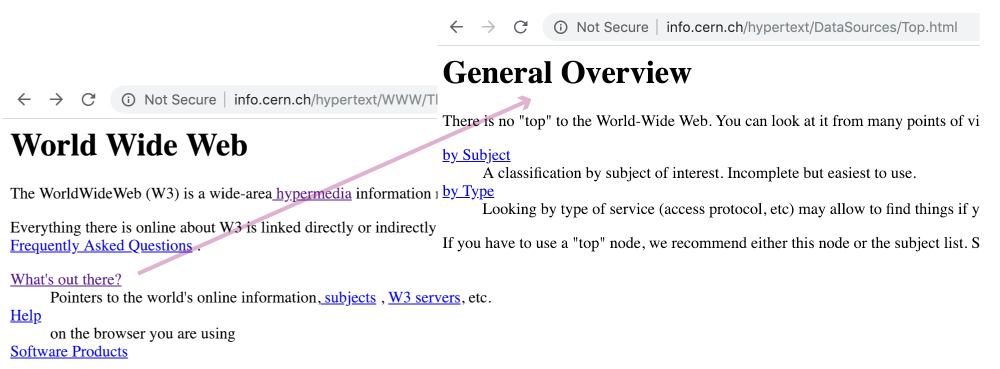

# Day 06 - HTML is a Markup Language

HyperText Markup Language, better known as HTML, is the foundational language of all content on the web.

To better understand what HTML is, let's break down the acronym.  

### HyperText

The "HT," **HyperText** refers to a system of linking topics to related information.  In short, it means a page that links to other pages.  

When you have a web page linking to other web pages, you have a website.  If you go back to the first [web page ever built](http://info.cern.ch/hypertext/WWW/TheProject.html), you'll notice it's literally just that: an HTML file that has links to other HTML files.

### Markup Language

The "ML" in HTML stands for **markup language**.  Markup language is a generic term that refers to *any* language that tells you how to format a digital document.  It does this via a standardized set of rules.  These rules are different depending on which markup language you are using.

Markup is easy to take for granted because almost all the interactions we have with text have markup applied.  When you are writing in a word processor, typing an email, or even looking at spreadsheets, you're looking at markup. 

In the following screenshot, all these popular interfaces - Google docs, email, and Google Spreadsheets - are using markup.  

Text that does not have markup is called **plain text**, and it's unlikely that you see it very often. 

To help demonstrate what markup does, we are going to look at what the first website looks like without any markup, i.e., in **plain text**. 

#### Exercise: Plain Text vs. Markup 
1\. Open the [first website](http://info.cern.ch/hypertext/WWW/TheProject.html) in a browser window.

2\. Select and Copy all the text on the web page.

3\. Open the [My Text Area](http://www.mytextarea.com/) website in another browser window.

4\. Paste the copied first website content onto the My Text Area web page.

You should see the following:

That is what plain text looks like.  Without markup, there are no links, and all the text looks the same.  Try this experiment with other text from a word processor, emails, or web pages.  Seeing the markup stripped away will give you a better understanding of what markup does.   

T>HTML is a markup language, not a programming language.  Programming languages allow you to run a process or execute an action, which HTML does not do.

Now that we have acquainted ourselves with HTML, tomorrow we'll get into HTML's syntax.