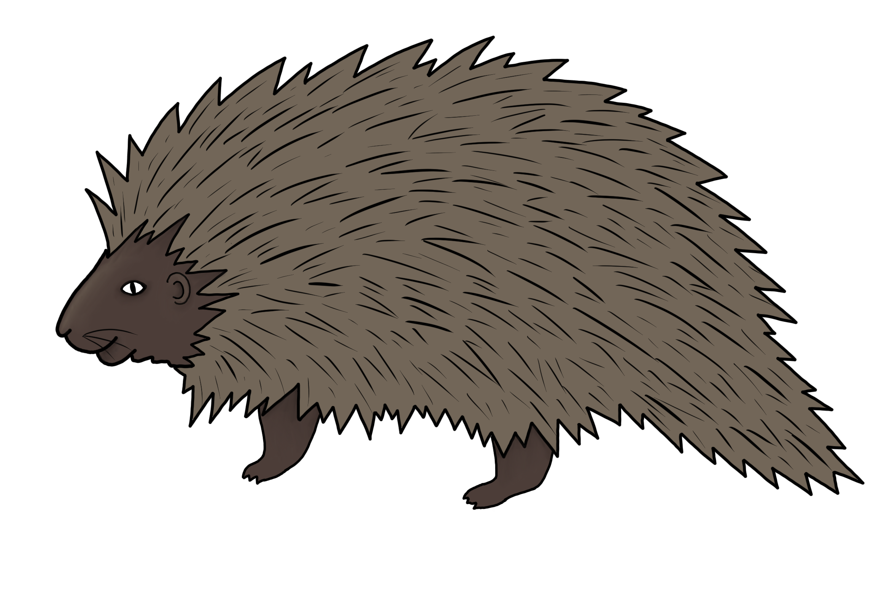

---
coverImageBackgroundPosition: "50% 87%;"
---

# Day 06 - Tags and Elements - HTML

Yesterday we learned that HTML is a kind of Markup Language.  HTML, however, is not the only type of Markup Language, this blog post for example is written in a Mark*down*[5]. 

If I wanted to write a **bold word** in this blog post, I start and end the word with double asterisks `**bold words**`.  In HTML, I would write bold words like this: `<b>bold words</b>`.  

Each markup language uses its own rules to define blocks of text and assign formatting.  HTML does this by using **tags** and **elements**.  

#### HTML Tags
HTML **tags** are special keywords surrounded by a pair of angle brackets `<tag keyword>`. Most tags come in pairs, with an opening and closing tag. The closing tag is the same as an opening tag with the addition of a forward-slash. The closing bold tag looks like this `</b>`.   

| HTML | In a browser | 
| :--------------------------: | :---------------: | 
| `<b>keyword: b </b>` | **keyword: b** |
| `<em>keyword: em </em>` | *keyword: em* |
| `<h3>keyword: h3 </h3>` | <h3>keyword: h3 </h3> |

Some tags, like the tag used to display an image ``, do not have a closing version.  This is because you do not need to define a opening and closing to display an image, just a location of where the image can be found.
{#porcupine}

| HTML | In a browser | 
| :--------------------------: | :---------------: | 
| `` |  |

There are close to 100 HTML tags [^html-tags].  Below are some of the more common ones.  If they have an closing tag, I've included it.

| Tag       | Tag Name          | Definition                            |
| :-------: | :---------------: | :-----------------------------------: |
| `

` | Paragraph      | To define the start and stop of a paragraph. |
| `<h1></h1>` | Heading      | These can range from h1 - h6.  The higher the number, the smaller the heading.  <h3>heading 3</h3> <h6>heading 6</h6> |
| ` ` | Line break     | Inserts a single line break.   There’s a single line break between these two sentences. |
| `

` | Division     | A division is a container to hold other elements.  It's very helpful in helping separate blocks of HTML|
| `<em></em>` | _Italic text_     | *italic text* |
| `` | Anchor     | You use the anchor tag to define what text should be clickable and where the click should take you. <a href="https://www.fullstack.io/">I navigate to the Fullstack.io website.</a> |

#### HTML Elements
HTML **elements** are individual components of HTML defined by HTML **tags**.  At first glance, **elements** and **tags** can easily be mistaken for the same thing, but the key to remember is that elements are made up of tags, but tags are not made up of elements.  

To help clarify, see the following examples of tags vs. elements.   

<b>Tags</b>
{lang=html,crop-start-line=1,crop-end-line=1}
    

    

    <b>
    </b>
    

<b>Elements</b>
{lang=html,crop-start-line=1,crop-end-line=1}
    

    
This text and the tags are considered an element

    <b>bold</b>
    
    

Where tags are used to define the start and stop of an element, elements refer to _both_ the opening and closing tag and everything in-between.  The elements that don't require a closing tag, like the `` element, are called **void elements**.  Elements are the building blocks of a web page and are a key concept that we will continue to revisit. 

T> **Elements vs. Tag**
T> Elements are made up of tags, tags are not made up of elements.  Elements are the building blocks of HTML.   Example of an element: `
Paragraph Element
`, example of a tag `
` 

Today was all reading and no doing.  Tomorrow, we'll change that and get our start playing with Tags and Elements using VSCode.

[^foo3]: https://en.wikipedia.org/wiki/List_of_document_markup_languages