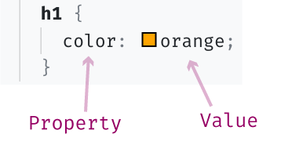
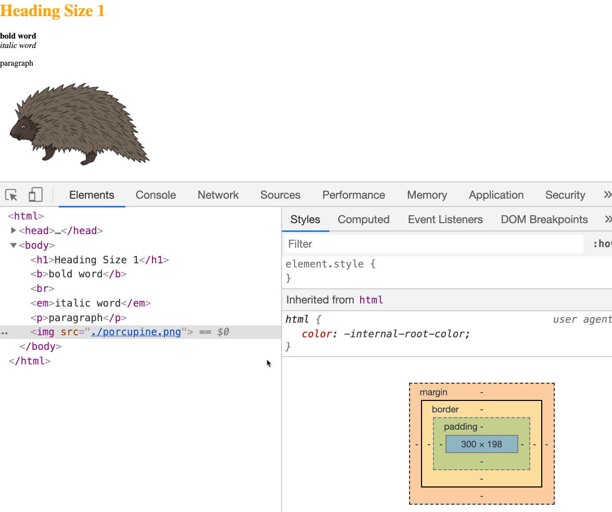
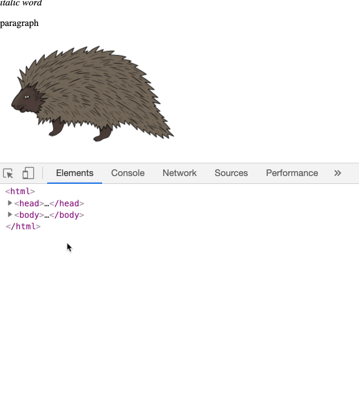
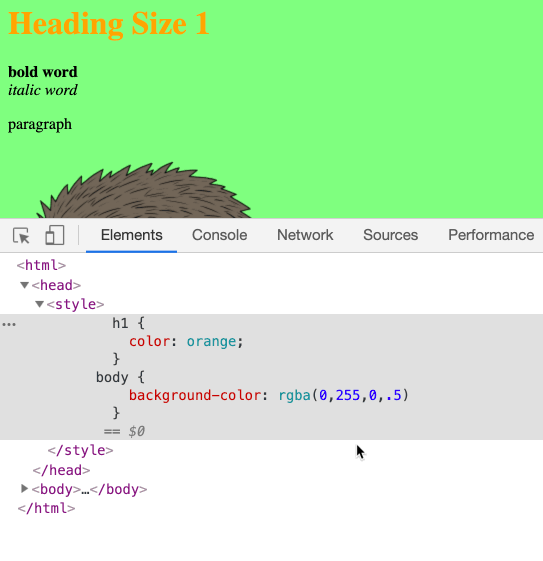
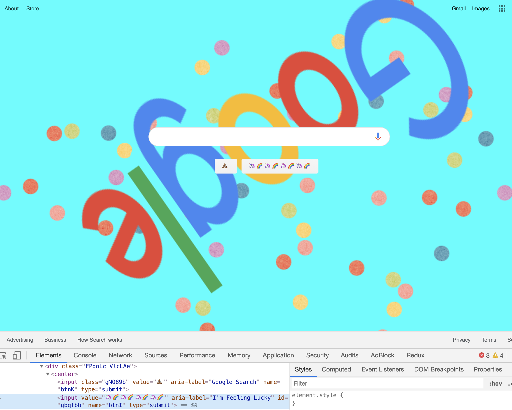

# Day 11 - CSS Syntax

CSS syntax is relatively straightforward, and you may have even picked up on the syntax basics through some of the previous examples. The three key components of writing CSS are **Selector**, **Property**, and **Value**.


### Selector
A **Selector** is what points to the HTML element. In the previous screenshot, `p` is the selector. This selector points to *all* paragraph elements on the page.  Thus, `p { color: blue; }` is telling us that all paragraph elements should be the color <span style="color:blue">blue</span>. 

### Property
A **Property** tells the browser what style you want to add. Is it color, font-style, or alignment?

There are a lot of CSS properties.  As you work with CSS, you'll naturally memorize some of them, but there will always be some you have to refer back to documentation about. 

A great place to search for information about CSS properties is the [Mozilla CSS Reference](https://developer.mozilla.org/en-US/docs/Web/CSS/Reference) (a.k.a., MDN web docs).  

### Value
A **Value** tells the browser by _how much_, _what color_, or the _allowed value_ you want to apply to that property. In the examples we've seen so far, this would include things like `right`, `orange`, and `100px`.

Here is an example of a value and property from when we changed the color of the heading element via an Internal stylesheet.



#### Exercise: Playing with CSS Syntax

1\.  Let's open our previous [css-practice.html](src/css-practice.html) file in the Chrome browser.

In this file, I am going to play with both Internal and Inline styles (External stylesheets use the same syntax as Internal stylesheets).

Open the DevTools.

2\. With the DevTools open, select the porcupine image, and add the following via the Styles pane.

```css
padding: 50px;
```



Padding is a handy CSS property that allows us to add space around an element.  We can even specify if we wanted to just added padding around one side by doing something like:

```css
padding-right: 50px;
```

3\. Once you've added the padding via the Styles pane, look over at the images HTML.

Look at the `` element in the Elements panel.  After adding the `padding: 50px` via the Styles pane, you can see that this style now appears as an Inline style on the Element.


This should look familiar.  We talked yesterday about how Inline styles are added via the `style` attribute.  Because the browser knows that you want to _add_ the style to that specific element, you don't need to include a selector. Nor, do you need to wrap your CSS' property and value in curly braces.

4\. Next, still in the DevTools, select the HTML `<head></head>` element (it will be toward the top).

Now, instead of adding CSS via the Styles pane, we are going to add CSS via the Internal stylesheet method.  Because we already have a `<style></style>` element on the HTML file, it's easy for us to see where to add additional Internal styles.

From within the Elements panel, click on the `<style></style>` element and then right-click -> "edit as html".  Then copy-paste or type in the following CSS:

```
body {
  background-color: rgba(0,255,0,.5);
}
```

Follow the gif if you get lost.


Unlike Inline styles, we first had to tell the browser what HTML element we wanted to target.  In this case we are targeting the `<body></body>` element, which is our **selector**.

Then, we wrap our CSS property and value in curly braces.  In this example, I mixed things up a bit and used the RGBA color-value.  RBG (**R**ed, **G**reen, **B**lue) and RGBA (**R**ed, **G**reen, **B**lue, **A**lpha) color values are helpful and commonly used.  You can learn more about them [here](https://www.w3schools.com/css/css3_colors.asp).

5\. One last step before we wrap things up.  Let's add another CSS property to the `<h1></h1>` element.  The reason, so you can see that when adding multiple CSS properties to one selector, you need to separate the property-value pair with a semicolon.

Again, either copy-paste or type in the following using the same "edit as html" method in the DevTools we did in the previous setup.

```css
font-family: cursive;
```



Keep playing around with editing the CSS via the DevTools.  And, if you want to take it up a notch, apply the same CSS we did via the DevTools, but this time in your text editor.  Just open the "css-practice.html" file in your text editor and use a combination of Inline or Internal styles to add the CSS.

Congratulations 👏 , you are now equipped with enough knowledge to make things look prettier or a whole-heck-of a lot uglier.

Remember, the DevTools are available on all web pages.  Go ahead and modify any CSS you can find on any of your favorite websites.  Modifying CSS or HTML in the DevTools is just changing your view; you can't break anything, so have fun.

Here, for example, is my rendition of Google's landing page if I were in charge of design.  All done via the DevTools.



In the next article, we'll look at a concept in CSS called **Selector Specificity** - say that three times fast 😬.
