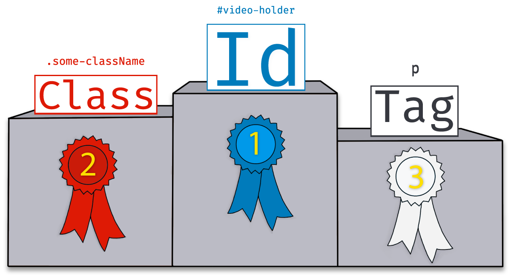
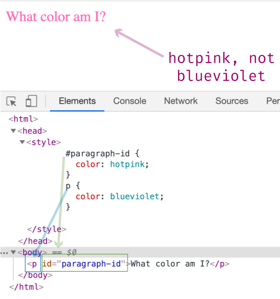
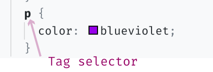
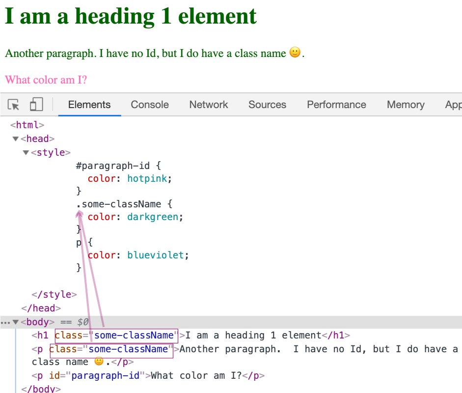
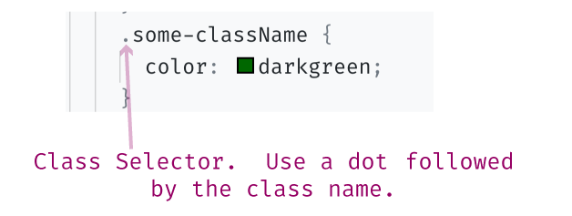
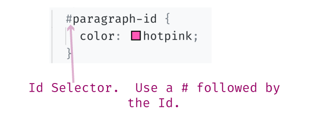

# Selector Specificity - CSS

### Selector Specificity

We learned in the last article that a **Selector** is what points to the HTML element.  For example, in the following code snippet the selector is the `p` tag:

```css
p {color: blue}
``` 

**Specificity** is just a fancy way of saying _specific_. The more specific a selector is the higher its priority.  You use different types of selectors to indicate how specific you want to be.

Q>What's easier to say, "toy boat" or "selector specificity" three times fast?  Try it out. I can say neither.

#### Different types of Selectors

There are three different types of selectors: Tag, Class, and Id. 

So far we've only looked at **Tag Selectors**.  Tag selectors are selectors that point to an element tag.  So `p`, `body`, `h1` are all examples of tag selectors.

Specificity comes into play because there is a pecking order between the 3 selectors.  The Id selector is the most specific (#1), the Tag selector the least specific (#3), and the Class selector is in-between (#2).



The reason it's important to know what selector is relatively more specific is that the more specific selector trumps the less specific selectors.

If I set a paragraph to <span style="color:blueviolet">blueviolet</span> using the tag selector, but also set the same paragraph to <span style="color:hotpink">hotpink</span> using the Id selector, the paragraph will be hotpink, not blueviolet.



To better understand the selector hierarchy, I am going to use an analogy and refer back to it as I walk through each selector's definition.

> **Analogy**
> Imagine you have a room full of friends, half identify as female, and one of your female friends is named Max.


#### Tag Sector


When you assign CSS by a Tag selector, you are assigning CSS to _any_ HTML tag of that type. For example, we used the paragraph tag to apply a color to it.



> Referring back to the friends' analogy, a Tag selector would be like saying, OK all my "friends," raise your hands. It's not very specific, so everyone in the room raises their hands.  
> 

#### Class Selector


A Class Selector is when you use an HTML element's **class** name to select it.

A class is another type of **attribute**.  Attributes live inside the element tag and provide additional information about that element.

The great thing about the `class` attribute is we can use it to give a class name to multiple elements.  Say, for example, we wanted a paragraph _and_ header element to both have a <span style="color:darkgreen">darkgreen</span> color.  Using the class attribute, we would give both elements the same class name. 

In the following example, I have given the `h1` and `p` elements the same class name: “some-className.”  Then, under styles, I assigned the “some-className” a color of darkgreen.



By using the class selector, we avoided having to assign a color value to both the `h1` and `p` tag.  Instead, we were able to do it with one CSS selector.

To use a class selector, you use a dot `.` + `className`.

 

> Referring back to the friends' analogy, a class selector is a little more specific than "friends," so it would be like saying, OK everyone who identifies as female jump up and down. Now you have everyone raising their hands.  But only the females jumping up and down while also raising their hands.


#### Id selector


Ids are another type of HTML attribute.  However, Id attributes, unlike class attributes, have to have a unique value.  

You can give multiple HTML tags the same class name, but if you use an Id CSS Selector, the Id's value can only be used once on the HTML document.


To select an element by its Id, you use the pound (a.k.a hashtag) `#` + `idName` syntax.  See the following example:



> Referring back to the friends' analogy, an Id selector is the most specific selector, and it has to be unique, much like a person's name is unique.  Assigning style based on an Id selector would be like saying, "Hey Max, just _you_, I want you to sing while you jump." Now you have everyone raising their hands, but only the females jumping, and poor Max jumping and singing.


### What's next?

Today was all about absorbing the information.  Tomorrow, we'll put that information into practice, and start playing with Selectors via our favorite: the DevTools.

