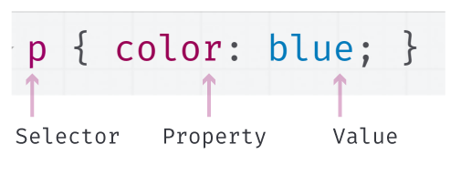
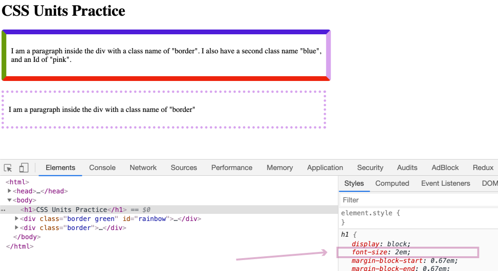
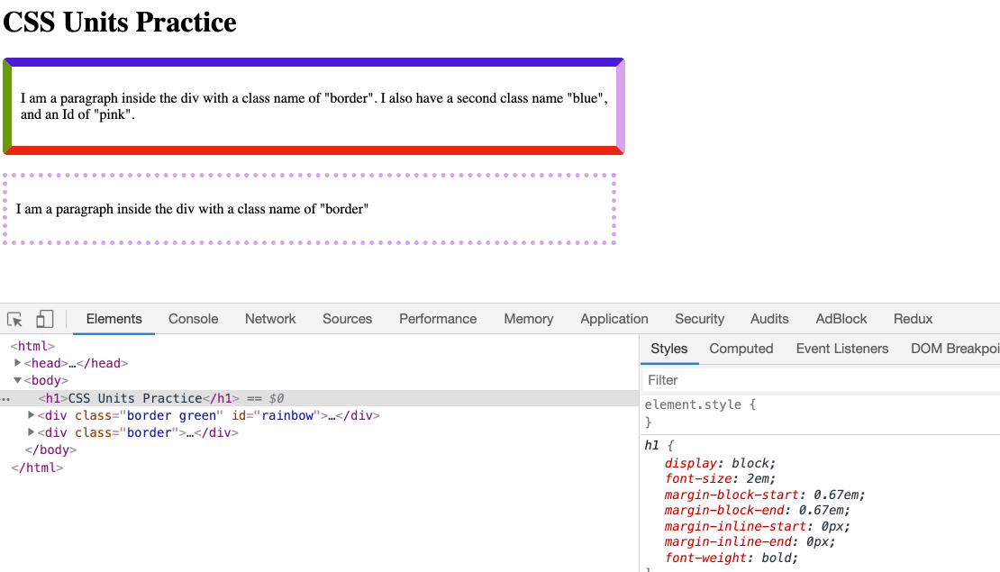
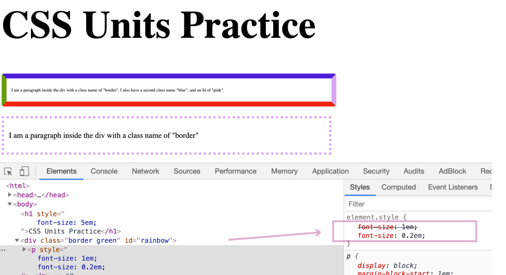
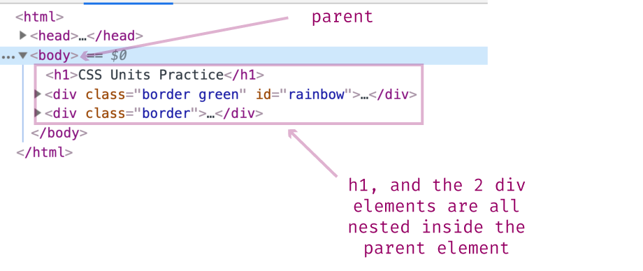
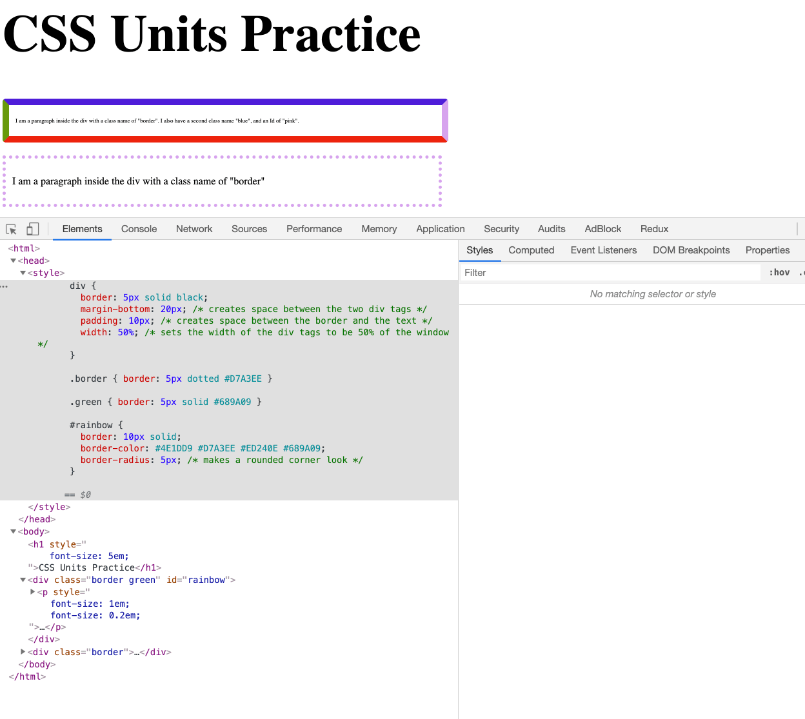
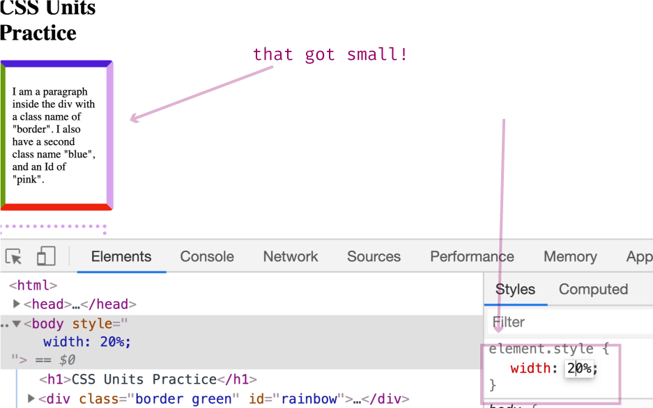
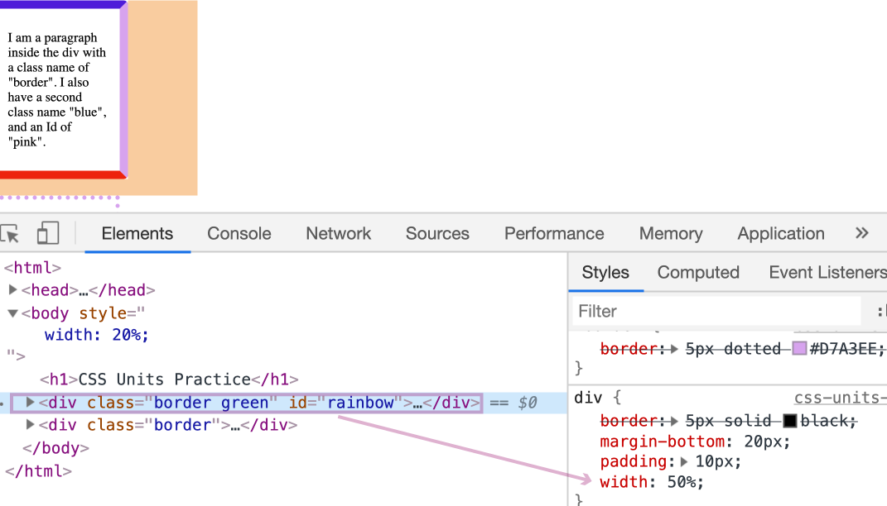
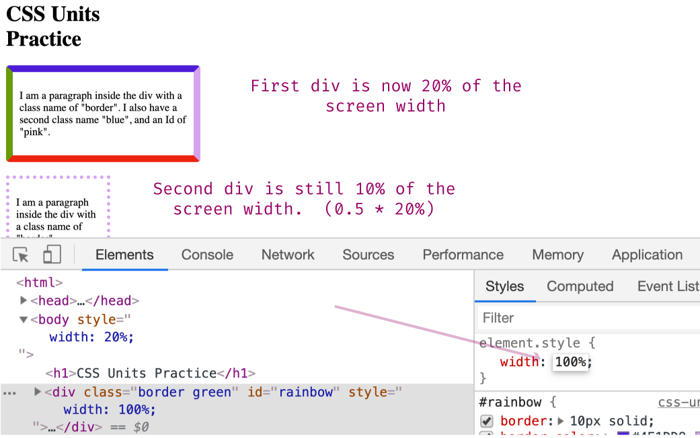

# CSS Units

We've been using CSS Units throughout our examples (ex: `10px`), but I have yet to stop and address what they mean.  Today we'll be focusing on the different CSS units, which indicate a size. We will use the DevTools to play with different variations.

Before we dive in, a quick refresher, when using CSS, you have to define a property and a value.  It's the value part that we'll be discussing.



The CSS value is either going to be some indication of size or color.  

### CSS Units - size indicator

When the CSS property is expecting a size/length value, we call this a CSS unit.  For example, in the following screenshot, we are assigning the CSS unit "10px" to the CSS property "padding."


A `px`, short for pixel, is one of many CSS units.  It's very common, and the one I've been using in my examples up until this article.  In the following table, I have listed all the CSS unit options.

Read through the descriptions, and think about under which circumstances you might use one unit type over the other.  Hint: some are better for dealing with changing screen sizes, and others are better at dealing with adjusting their size relative to other elements.

| Unit |                                                                                                                   Description                                                                                                                    |
| :--: | :----------------------------------------------------------------------------------------------------------------------------------------------------------------------------------------------------------------------------------------------: |
|  px  |                                                                      Pixels are relative to the view device. In general, pixels measure out to be 1 px = 1/96th of an inch.                                                                      |
|  pt  |                                                                                        Points are traditionally used in print media. 1 pt = 1/72 of an inch.                                                                                        |
|  em  | em is a scalable unit. You define a base, and then use that as a reference point. Say 1em is equal to the current font size then 2em would be double the current font size. They are popular on the web because they are "mobile-friendly." |
|  %   |                                                                                Percent. An example might be 50%. These are also scalable and relative to a base.                                                                                 |

In most cases, these units are set to be equal to each other such that:
16px = 12pt = 1em = 100%. In the following table, I am using these sizes on each line item. You can see that the "Howdy!" on each line is the same size, even though each value is different.

| font-size: value |               Example                |
| :--------------: | :----------------------------------: |
| font-size: 16px  | <p style="font-size:16px">Howdy!</p> |
| font-size: 12pt  | <p style="font-size:12pt">Howdy!</p> |
|  font-size: 1em  | <p style="font-size:1em">Howdy!</p>  |
| font-size: 100%  | <p style="font-size:100%">Howdy!</p> |

Now let's see what happens when we use the same value for each unit type (5 is the value we'll be using). Notice how much larger em is than 5%? You can't even see 5%, and 5em is huge.

| font-size: value |               Example               |
| :--------------: | :---------------------------------: |
|  font-size: 5px  | <p style="font-size:5px">Howdy!</p> |
|  font-size: 5pt  | <p style="font-size:5pt">Howdy!</p> |
|  font-size: 5em  | <p style="font-size:5em">Howdy!</p> |
|  font-size: 5%   | <p style="font-size:5%">Howdy!</p>  |


#### Exercise: Using the DevTools to Play with Units

To get more familiar with CSS Units, we are going to be using the DevTools' Style pane to make changes to our previous "css-selector-practice.html" file.

1\. In Chrome, open [`css-units-selector.html`](code/src/3-adding-style/4-html-css-selector-final.html). I renamed the file and changed the text in the header, but everything else is the same as the previous "css-selector-practice.html."
 
2\. Open the DevTools.  Navigate to the Elements panel and click on the:

```<h1>CSS Units Practice</h1>```

Notice, under the Styles pane, the `font-size: 2em`.  This is the default font-size the browser automatically gives to any `h1` elements it sees.  We are going to change that.



3\. Just above the `font-size: 2em`, you'll see another section in the Styles pane called "element.style."  In this section, type in:

```font-size: 5em```  

Adding CSS here will override the browser's default CSS of `font-size: 2em`.



The font's size changed pretty dramatically.  Remember `em` is a scalable unit, so a change from 2 to 5 makes a big difference.

4\. Next, select any of the paragraph elements, and just like we did in the previous step, try adding a new font-size.  This time make it:

```font-size: 1em```

Nothing should change.  Why is that?  Because 1em is the _base_, and em is a scalable unit, with the base of 1em. 

So what happens if we change it to 0.2em? Try it out. 



The font gets much smaller and becomes quite hard to see 🧐.

5\. I am using the HTML `<div></div>` element to separate the different paragraphs from each other.

On each of these `<div></div>` elements, I have set their width to 50%.  Meaning they take up 50% of the width. Or more specifically, it is saying "make this div 50% of its parent's width."



**Parent** is a common term in CSS and HTML.  We won't cover it here, but for our purposes know that it is the element that *contains* the div.  Another way of saying this is that the `<div></div>` element is *nested* inside the parent.  In this example, the parent is the body element.

Let's change the `<body></body>` element's width to 50%, and see what happens.



Notice, how the div tags shrunk?  Their width went from 50% of the screen width to 50% of 50%, i.e., 25% of the screen width.  This happened because the percent CSS unit is a relative unit.  In this case, the div width of 50% is relative to its parent.  When we shrunk the parent's width, the div width also shrunk.

7\.  I know the parent, percent thing can be a bit confusing.  So we'll do one last step to help bring this home.  We are going to make the body width 20%, and then the divs' width 100%.  Before we do this, try and guess what will happen.

Just like we did in the previous step, change the body's width to 20%.



That looks pretty small. But remember, the div elements are 50% of the body element.  So right now, those divs are 10% of the screen width.

To help show this, select the first div via the Elements panel.  Then look over at the Styles pane and notice the div has a width of 50% (this is set via Internal Stylesheet, which you can view if you open the file with your text editor).



Go ahead, and in the "element.style" section on the Styles pane, override this 50%, by adding:

```width: 100%```

You should see this first div now take up 20% of the screen width, whereas the second div is still taking up only 10%.



6\.  Continue playing around, adjusting various CSS units.  For example, try adjusting the paragraphs font-size to 20pt, or 500px.

### What's next?

That wraps up our CSS discussion. CSS is powerful and has a lot more use cases and caveats that we did not have time to cover.  If you plan on going into Web Development, plan on spending a substantial amount of time learning CSS.  The more you learn about CSS, the more powerful of a developer you'll be.  

In addition to the topics covered in these blog posts, I recommend spending time understanding the Cascading Mechanism, the CSS Box Model, FlexBox, and for fun, CSS animations.

Next up, is JavaScript.  Like CSS, I cannot teach you JavaScript over a couple of blog posts.  Instead, I hope to get you familiar with what JavaScript is, what it does, and some understanding of how prevalent it is.