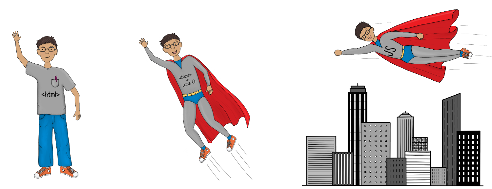

# Day 15 - Adding Interactivity - JavaScript

HTML gives the web structure. CSS provides that structure with style.  **JavaScript makes that structure *interactive***.

To give you a better sense of what I mean by "interactive", we are going to play with JavaScript using HTML examples that have JavaScript already on them.

T> **JavaScript is a programming language**, unlike HTML and CSS, which are markup languages. We will learn more about Programming Languages in later blog posts.

#### Exercise: What does "interactive" look like? 

1\. Open the following HTML file in a Chrome window:
[`/js-example.html`](src/js-example.html). 

Once open you should see a web page that looks something like the following:

The rabbit 🐇 and turtle 🐢 will start racing right away.  Play around with stopping and restarting the animation.  

3\.  The "racing" between the rabbit and turtle, as well as the buttons "stopping" and "restarting" the race is all done by JavaScript.  This is an example of what interactivity looks like.

If you are curious and would like to look at the JavaScript causing this interactivity, in your text editor, navigate to row 61 on the `js-example.html` file.  Row 61 is where the JavaScript code starts.

T>Don't let the code overwhelm you. I simply want to point out where it lives on the HTML file.  By no means do I expect you to understand it.

We will revisit the racing rabbit and turtle in a later blog post.  But let's look at some other amazing examples of JavaScript making the structure interactive.

#### [Histography](http://www.histography.io/)
*http://www.histography.io/*

Using JavaScript[^histography], this site pulls data in from events from a variety of sources including Wikipedia, Google image and YouTube.

It consumes the data, and then makes it visually appealing and digestable to see 14 billion years of time.

#### [Multeor](http://multeor.com/)
*http://multeor.com/* 

Written in JavaScript, Multeor is a multiplayer game that allows you to control a metoror crashing into earth.  Don't be fooled, you're not trying to save earth 🌎, but rather leave the biggest path of destruction.  Eight players can play at once.

Multeor is impressive because most online games use other technologies/programming languages to handle complex animations. But Multeor, written in plain JavaScript, proves how powerful plain JavaScript _can_ be[^node].

I>I use the word "plain" to describe JavaScript, because, as we'll learn later, there are lots of libraries and frameworks that build-off of JavaScript, enhancing the language.  When I say "plain", I mean written in pure JavaScript, not using one of these libraries or frameworks.

Hopefully, these examples give you a sense of what JavaScript does; it adds interactivity.  Next, we'll look at why JavaScript is so important.

[^histography]: According to various tech stack websites, Histography more specifically uses the jQuery library, which is a library built on-top of JavaScript. For those that have worked with jQuery, this blows my mind 🤯.
[^node]: Multeor uses Node.js manages communications between the devices using WebSockets.