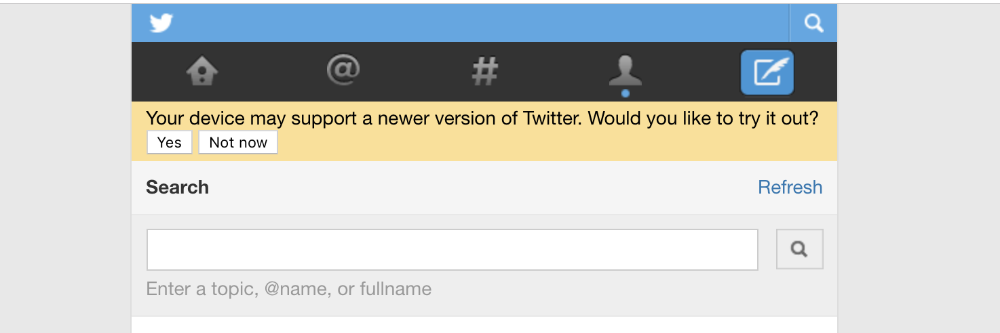

# Day 16 - Why is JavaScript important?

No matter what kind of programmer you decide to become, JavaScript is a language that you will need to know.  The most recent statistics show that JavaScript is used by about **95% of all websites**[^percent].

Today, we'll get a sense of how important and prevalent JavaScript is on the web and look at how it came to be that way.

#### Exercise: The web without JavaScript

Sometimes to appreciate something, you have to lose it.  We're going to take that approach with JavaScript; we're going to interact with the web *without* JavaScript.  Hopefully, this Exercise will show you just how much of your day-to-day interactions with the web rely on JavaScript.

1\. In your Chrome settings there is an option to disable JavaScript, [here is a quick link](chrome://settings/content/javascript?search=javaScript) to get there.

2\.  Toggle off JavaScript.

3\. Get ready to miss JavaScript.

Go ahead and toggle on and off the JavaScript option in Chrome.  While doing so, compare before and after versions of various websites.  Some good sites to try are Twitter or YouTube or try searching for something on Google.

Here is what Twitter looks like without JavaScript enabled; ugly and hard to use.  

4\. Don't forget to turn JavaScript back on.  You may need to close and open your browser again for JavaScript to be reapplied.

Did you miss it?  I sure did.  The web isn't the same without JavaScript.

### How JavaScript came to be so important?

JavaScript was created in 1995 by Brendan Eich who had just 10 days to write it. For perspective, these 30 blog post will take at least 3 times as long to write.  And though I fancy myself an OK read, I don't have any delusions of grandeur; though Eich probably didn't either... 🤔

But why did Eich have only 10 days to write a programming language? What kind of taskmaster boss did he have?!

If you were alive during the early 1990s, and you used the internet, the browser you used was called Netscape Navigator.  Netscape Navigator was so dominating it was pretty much the only browser anyone knew of.  In 1995, Eich was hired by Netscape.  

When Eich was brought on, Netscape was trying to figure out how to make it so anyone could add interactivity to the web.  At the time, everyone's web experience was a lot more like the web in the previous "Exercise: The web without JavaScript."  Netscape's solution was to make a new programming language that could be processed by the browser.  

Eich, who had experience writing programming languages, was asked to write a prototype.  But why only in 10 days? Because competition.  Microsoft was moving quickly in the background. Suffice it to say, Eich had 10 days, or some other language was going to hit the market first.

>"JS (JavaScript) had to 'look like Java' only less so, be Java’s dumb kid brother or boy-hostage sidekick. Plus, I had to be done in ten days or something worse than JS would have happened." ~Brendan Eich

This is, of course, a truncated timeline of events, and if you are at all curious to learn more, I highly recommend the [JavaScript Jabber podcast's interview of Eich](https://devchat.tv/js-jabber/124-jsj-the-origin-of-javascript-with-brendan-eich/).  

#### How JavaScript got its name
Eich's new programing language was first called Mocha.  Netscape's marketing folks didn't like the name and changed it Live-Script. Then later, due to some trademark licensing with a different language called Java, Live-Script was changed to JavaScript. Which, unfortunately, for the rest of time, has had the ill effect of suggesting Java and JavaScript have something to do with each other; they do not.

#### Rising Popularity
I'm sure Netscape had some inkling that creating a programming language which was rendered by browsers, would change the game.  Though honestly, I doubt Netscape understood the extent of the change.  Before JavaScript, if you wanted to program on the web, the only way to process a programming language was with some other piece of technology.  JavaScript is unique because it can be read and processed by the browser.  We'll see this in tomorrow's blog post.

JavaScript is the only programming language that is rendered by all major web browsers.  What this means is that anyone with a computer and the internet can "program," or as we've seen, add interactivity to web pages. Before JavaScript, that wasn't possible.  Your tooling was more complicated, and the skills required to use and access that tooling needed to be more advanced.

In some sense, JavaScript was like the Ford of the automobile industry, given access to the masses and tearing down barriers to entry.  Thus, JavaScript's popularity wasn't the result of marketing efforts or because it's a "great" programming language.  JavaScript is popular because it made itself accessible to virtually everyone.

### What's next?
Now that we have a sensible appreciation for JavaScript, tomorrow we'll play with JavaScript in the DevTools.  The reason we will be using the DevTools is that, remember, all major browser can read and process JavaScript 😉.

[^percent]:https://en.wikipedia.org/wiki/JavaScript