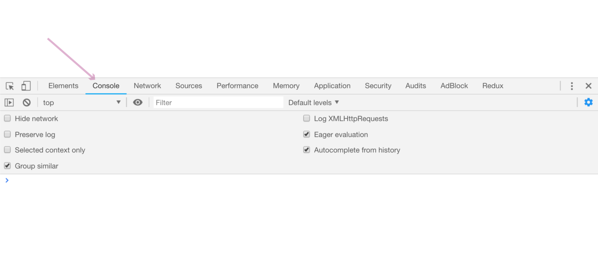
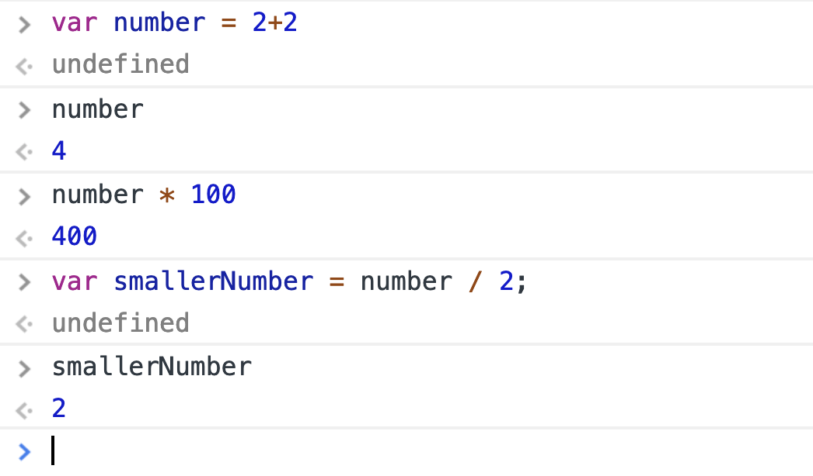
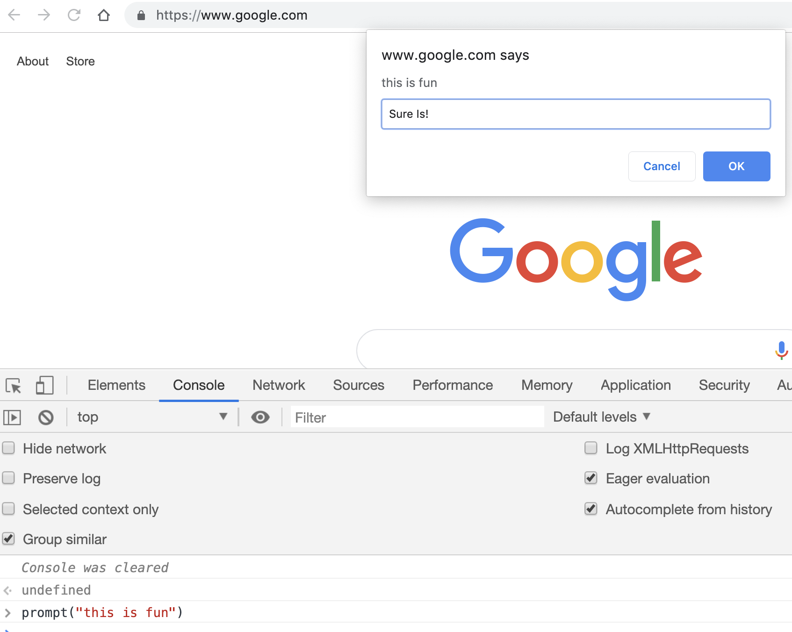

# Day 17 - JavaScript in the DevTools

There is no way I could reasonably teach you all you need to know about JavaScript in a couple of blog posts. Instead, I am going to show you some JavaScript code snippets, and show you that they can be executed in the DevTool's Console.

### JavaScript in the DevTool's Console

All major web browser come shipped with JavaScript[^majorbrowsers].  Without getting into too many details, what this means is that the browser can *read* and *run* the JavaScript language[^jsengine].  

For us, this also means that we can type JavaScript directly into the browser's DevTool's Console and it will read and run JavaScript on the fly.

#### Exercise 3 of 12: JavaScript in the Console
1\. Open the [js-example.html](src/js-example.html) file we used in Day 15, in a Chrome browser window.

Next, open the DevTools (cmd + alt + j).    

2\. Navigate to the **Console**.  You'll find this panel just to the **right** of the Elements panel.



3\. The **Console** is a panel in the DevTools where Chrome executes commands that you type there. The Console is not unique to Chrome.  All major browsers have one.  

4\. Go ahead and type the following commands into the Console.  Once added, press **enter** to execute the command.  

I>In the following screenshots, you will see the word `undefined`. This is what the browser returns after declaring a variable.  We don't need to know why that is, just know that the screenshots will include what the browser returns.  I point this out, so you don't think you need to type `undefined`, that's just what the browser returns after you hit `enter`.  You should be typing what follows the symbol `>`, and the computer's response follows the symbol `<`. 

For the following command, go ahead and replace `Angel` with your name. 


T>I am using screenshots here instead of a code snippet in a passive-aggressive maneuver to get you to type the commands instead of copy-pasting them.  The reason: you learn by doing, you're welcome 😇.

5\. The next couple of commands perform simple JavaScript calculations.  Go ahead and type these in the Console as well.  



6\. Next, we'll trigger a prompt message (a window that opens up asking you to fill something in).  To do this, type the `prompt` command into the Console with a message.


Now enter a response in the prompt that pops up and click "OK." Look back in the Console.  You should see your response.



The above Exercises are designed to get you familiar with playing with JavaScript in the Console.  Don't get caught up on the syntax; get comfortable with executing JavaScript in the Console.

I've already talked a bit about how the browser can read JavaScript, and that this is not the case for other programming languages.  To help bring this point home, try typing the following PHP code snippet into the console.  PHP is a top ten programming language, which we will learn more about in a later blog post.

```php
echo "Come on browser...🎲!!";
```

You'll get an error.  Now try the JavaScript equivalent of the PHP `echo` command, `console.log()`.


PHP 0: JavaScript 1.

Again, the point of this blog posts is to introduce you to JavaScript, and show you that the browser can interpret it.  Which, as we saw with PHP, is not the case for other programming languages.

Tomorrow, we'll take a look at some of those other programming languages.  Specifically, we'll identify the top 10 most popular.

[^majorbrowsers]:https://www.enable-javascript.com/
[^jsengine]:https://en.wikipedia.org/wiki/JavaScript_engine