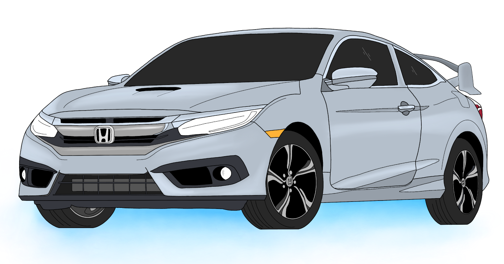
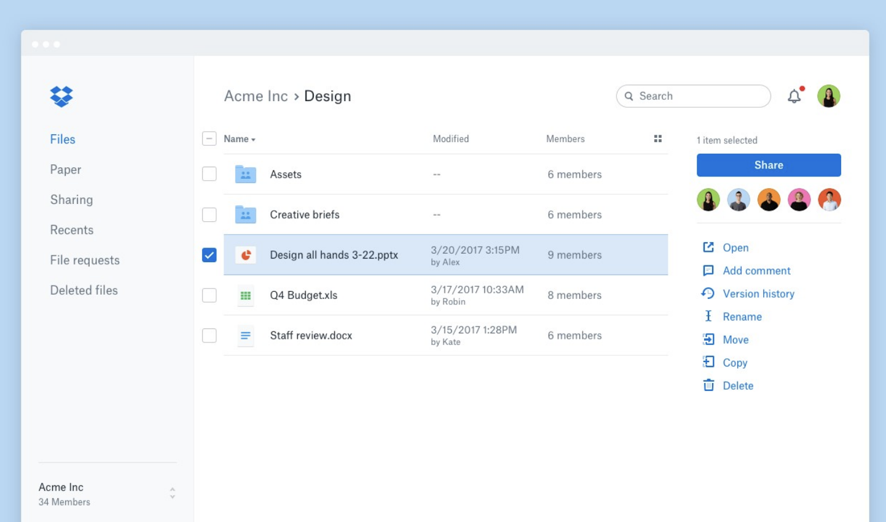

# A closer look at the top 4 Programming Languages

Now that we have a sense of what the top Programming Languages are, we should investigate what these Programming Languages are used for.

In today's blog post, I will cover the top 4 most popular Programming Languages (according to Github's Octoverse).  I discuss the remaining 6 languages in the 📗 "How to Become a Web Developer: A Field Guide."  In this book, I also add code snippets and examples of companies that use the language.

W>**Disclaimer**: In the following sections, I'll be speaking in very broad terms to try and give you a sense of the space as a beginner -- each of these languages are versatile, and you’ll see them being used in lots of ways. Consider what I’m describing as a stereotype, with all of the benefits and drawbacks that come from generalizing.

> **Car Analogy 🚙**: To help relate these languages to something you are more familiar with, at the end of each discussion, I'll relate the language back to a car[^analogy].

### 1. JavaScript: The Language of the Web

As we learned in an earlier blog post, JavaScript is seemingly everywhere on the web. It's in every web browser, every smartphone, and billions - literally billions - of other devices.

JavaScript is a great first Programming Language to learn. I would suggest that anyone going into Web Development should learn JavaScript to an intermediate level.

> If JavaScript were a car, it would be a **Honda Civic**. It's everywhere, affordable, only needs an oil change to keep it going, and dang do people like to trick them out! _React - the Library that enhances JavaScript - is a lot like your cousin's tricked-out Civic_.

> 

### 2. Java: An Industry Workhorse

Not in any way related to JavaScript, Java is an extremely mature language. It is well supported and used in lots of applications, including very large services.

While some may consider Java "verbose", Java is also considered a relatively easy Programming Language to learn. It has an extensive class library, and a strong open-source community - meaning that a lot of functionality is already written for you.

Java is used for both web applications, like Google Docs, and also for applications on your computer. For example, any Open Office[^openoffice] application - think applications like Microsoft Word or Excel - is written in Java.

Java is now owned by Oracle[^oracle], so if you are using Oracle products, then it's a safe bet that Java is involved.

Java is also a popular language for use in Android Smartphone applications, and the Internet of Things (IoT).

T>The term IoT will come up in other Programming Languages. It essentially means anything that provides a system of related computer devices that talk to each other over a network[^iot]. Examples include things like home security systems (e.g., Nest), or Amazon Alexa and Google Assistant[^iotex].

A downside of Java is that historically it tends to use up a lot of memory (though this has improved in recent years). It is powerful, but that power comes at a cost.

> If Java were a car, it would be a **Sprinter Van**. It's practical, strong, easy to adapt to whatever utility. But it's a little slow and forget about getting under its hood.

### Python: Bring on the Data

Python has grown into a very popular language used for software development, infrastructure management, and data science. It is also a key driver in big data analytics and artificial intelligence (AI)[^python].

Python can be used for desktop General User Interface (a.k.a. GUI) applications; think of any application you download and put on your computer. For example, Dropbox's Desktop interface is built using Python[^dropbox].

Where Python shines is in **data science**. The libraries for scientific and mathematical computing in Python are mature and widely used in both industry and academia.

Nearly all of the popular open-source libraries for _Deep Learning_ (such as Tensorflow or PyTorch) are based on Python. If you are interested in machine learning or artificial intelligence, then Python is a mandatory language to learn.

> If Python were a car, it would be the **BMW 3 Series**. The BMW 3 Series has long been acknowledged as the best of luxury sedans for many years. It's reliable and still offers high performance.

### PHP: One of the Web’s Original Languages

PHP, though on a mild downward trend, is not going away anytime soon. WordPress is built on PHP. If you are not already familiar with WordPress, it is a website creation tool. WordPress _is the largest_ Website Creation tool, and it is estimated that 27% of the websites on the internet are powered using WordPress[^wp]. If you want to build WordPress websites, you'll need to know PHP.

Facebook also uses PHP. However, Facebook is somewhat "old," and it is generally thought that if Facebook were to be started today, they would use something other than PHP.

That said, PHP is very powerful, which is why Facebook can still use it. But you’ll find that most Silicon Valley companies don’t choose PHP for new projects anymore. Instead, they tend to favor other technologies like Node.js[^node], [Ruby on Rails](https://rubyonrails.org/) or other languages like Java/Python for this role.

PHP used to be the de facto Programming Language to learn after JavaScript, but with the rise of Node.js, Java, and Python, this is not the case anymore. While PHP still has its advocates, I would only recommend learning PHP if you want to work on WordPress sites, or the job you want is looking for PHP developers.

> If PHP were a car, it would be the **Toyota Camry**. The Toyota Camry is better today than it has ever been (just like the new PHP 7). The Camry was one of Toyota's best selling vehicles for many years. But times are changing, and everyone wants SUVs.

### What's next?

Tomorrow we're going to take a slight detour and talk about Libraries and Frameworks, which are often talked about as if they were Programming Languages.  We'll clarify this relationship.

[^openoffice]: https://en.wikipedia.org/wiki/OpenOffice.org
[^oracle]: https://www.oracle.com/sun/
[^iot]: https://en.wikipedia.org/wiki/Internet_of_things
[^iotex]: https://iot.do/devices
[^dropbox]: https://realpython.com/world-class-companies-using-python/#dropbox
[^wp]: https://www.whoishostingthis.com/compare/wordpress/stats/
[^node]: Node.js is not a Programming Language, Framework or Library. It is a run-time environment built on the Chrome JavaScript engine. https://en.wikipedia.org/wiki/Node.js
[^analogy]: I'm taking the concept from Rory MacDonald and his article on the [Pros and Cons of Ruby on Rails](https://www.madetech.com/blog/pros-and-cons-of-ruby-on-rails), but I'll be making some tweaks to fit our discussion.
[^python]: https://www.python.org/about/