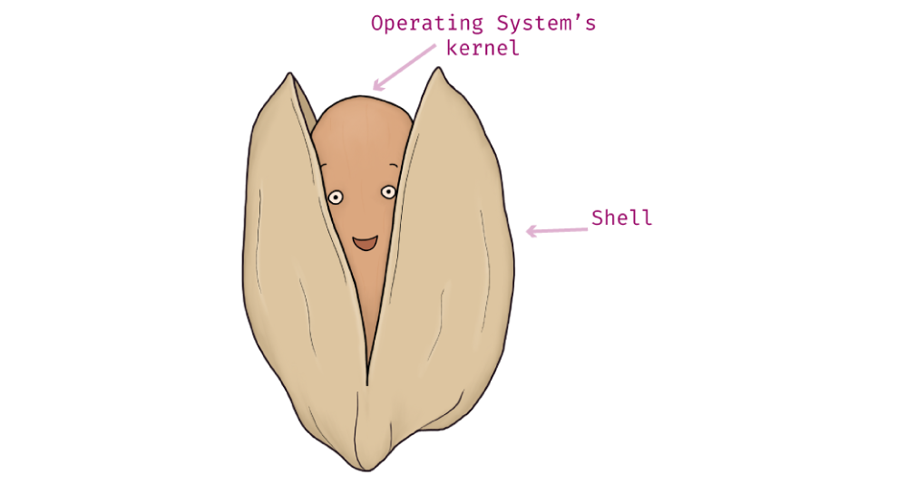

# Day 24 - CLI vs. GUI?

We chatted about Shells in Day 3 and 4, during our Operating System discussions.  As a quick reminder, a Shell is an interface that gives you access to your computer's operating system. Think of it as a wrapper around your operating system - technically it wraps around your operating system's kernel. Hence the name _Shell_ - a shell/protective barrier - around the brain/core of your computer.

Shells come in two forms:

1. **Command Line Interface**: CLI for short, pronounced C. L. I.

2. **General User Interface**: GUI for short, pronounced "gooey".

### CLI

An example of a CLI is the Bash Shell or PowerShell that comes default with macOS and Windows OS, respectively (this is the Shell we played with via the terminal in yesterday's article).

CLI's, like Bash or PowerShell, allow you to interact with your computer's operating system via writing text commands.

I>**Windows Users**: PowerShell is not just a Shell; it is also the application that allows the user to interact with the Shell. Compare this to macOS, which has both the default Shell called Bash, as well as the Terminal application (with a capital "T") that allows the user to interact with Bash. PowerShell is a complete environment, acting as both the Shell and the terminal application.

### GUI

As discussed in day 4, GUIs are programs you are very familiar with.  GUIs are programs designed to make it easy for the everyday computer user to _do_ things with their computer. They use graphics, icons, and menus to make navigation and executing commands easy.

GUIs evolved to make it easier for computer users to do things and navigate around the computer. GUIs are on smartphones, smartwatches, anything computer-based you'll find GUIs.

Here is an example of a GUI on the iPhones iOS. The GUI provides the icons, and menus you use to navigate or _do_ things on your iPhone.

Here's one more example of a GUI on a smartwatch that starts your Tesla - wouldn't that be nice!

Before GUIs, computer users only had a keyboard and computer screen as tools. To do anything on the computer the user had to type out commands via a CLI. This process is not intuitive for today's average computer user. In comes GUIs. GUIs - for the majority of computer users - make navigation and actions easier to figure out.

In the following Exercise, we are going to spend time with the Finder program (the equivalent program in Windows is “File Explorer”), doing simple, everyday navigation.

#### Exercise: Playing with a GUI

1\.**macOS Users** Open the Finder program on your mac (cmd + spacebar, type "Finder")

1\.**Windows Users**
This process will be the same for Windows users. Your GUI will look a little different. Instead of using the Finder program, you'll be using your [File Explorer](https://support.microsoft.com/en-us/help/4026617/windows-10-windows-explorer-has-a-new-name) program.

2\. Once open, navigate to your Downloads folder.

3\. In your Downloads folder, go to the Finder menu at the top of your computer screen and click File -> New Folder.
{#newfolder}

4\. Name the folder and move some files into it.

We will be using this same folder later. If you'd like, name it the same as my folder here - "nuts" - otherwise name it whatever you'd like. Just remember the name for later exercises.

Ta-da you just used a GUI! You used the Finder's menu dropdowns to do things like make a folder and move stuff into it.

GUIs are everywhere. If you find yourself navigating, clicking, or selecting graphical elements to _do_ something to a device, then it's a safe bet that you are using a GUI.

### CLI

Unlike a GUI, a CLI only takes commands that we type. It (generally) does not accept mouse inputs, nor does it have icons and buttons to help you _do_ things. Instead, you command it to do things via your keyboard.

We've established that a Shell is a wrapper around a computer's operating system and that a GUI is a type of Shell. The other kind of Shell is a CLI - for our purposes, we will refer to this type of Shell as a Shell-CLI.

I> When computer folks are talking about Shells, it's likely they are referring to a Shell-CLI. However, because we know a Shell can be both a GUI or CLI, we will differentiate them here as either Shell-GUI or Shell-CLI.

The standard Shell-CLI shipped with macOS is **Bash**. Bash has been the standard Shell-CLI shipped with the majority of computers since the early 1990s[^bashstandard]. The standard Shell-CLI for Windows 10 users is PowerShell (out-powering the older "Command Prompt" still available on Windows OS).

### Where does the terminal fit it?

The terminal and PowerShell are CLIs; they take in typed commands and interact with your computer's operating system.

The macOS terminal is an app. It is not a Shell.

Window's PowerShell is slightly different in that it's both an app, but also a Shell.  Window's users have the option of downloading the Bash Shell-CLI that macOS comes shipped with and is the Shell by default that the terminal program interacts with. If you're curious, [here are instructions](https://www.howtogeek.com/249966/how-to-install-and-use-the-linux-bash-shell-on-windows-10/) of how to download and use the Bash Shell for Windows 10.

I know this all might seem a little pedantic, but the reality is a lot of people don't understand the difference between CLI and GUI. However, having even this general understanding of their differences will help you learn more advanced programming concepts as you progress in Web Development. 

Tomorrow, we'll look closer at File Paths; a topic near and dear to my heart. Why?  Because it's a simple yet crucial concept to anyone developing on computers, and folks like to assume everyone knows.  But I can tell you, most don't.  They fake it until they get stuck, and then resort to guessing.
