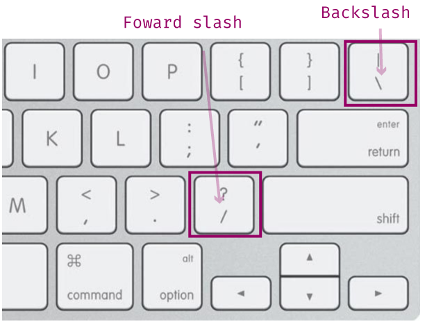
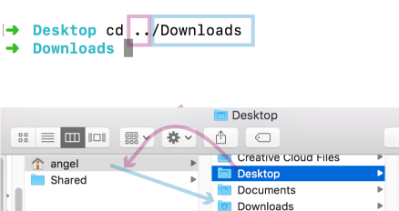
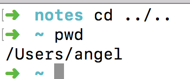

# File Paths Part I

> File Paths are grammar's equivalent to the words "except" and "accept."  People don't _really_ know the difference, they guess and hope for the best 🤞.

In this article, we'll first define what a File Path is and then look at the two types, their syntax, and what they mean.

I> **Windows Users**: File Path syntax is essentially the same for macOS and Windows OS users. The only difference is the use of forward / vs. backslashes \ in File Paths.  Windows uses backslashes. However, Powershell corrects for this difference; if you put a backslash, it will change it to a forward slash. As such, I have not modified my examples to correct for this as it won't affect what we're doing. If you're curious about the history, I recommend [this](https://www.howtogeek.com/181774/why-windows-uses-backslashes-and-everything-else-uses-forward-slashes/) article.




### What are File Paths?

File Paths are how you indicate to a computer, where'd you like to go.  For example, in our terminal article, we wanted to navigate to our Downloads folder, so I had you type the following command:

```
cd ~/Downloads
```

In English, you told your computer:

>"Change Directories to my computer's home directory and then go to the Downloads folder."


You end up using File Paths a lot as a developer because you often need to tell a computer where you'd like to either go or where the computer can find something. For example, below is the HTML `img` element with a `src` attribute.  The src attribute is using a File Path to tell the browser where to find the image.

```html

```

There are two types of File Paths you can use: **absolute path** and **relative path**.

#### Relative File Paths

We will start by defining a **Relative File Path**. The key to understanding Relative File Paths is in the name; it means **relative to where you are**.

If a File Path starts with a dot **`.`** the same keyboard symbol for a period, then it's a Relative File Path.

A single dot means you want to look in the same folder you are currently in. In the following example, I'm in my Desktop folder.  My command is telling the computer to Change Directories into the notes folder.  And the notes folder is on my Desktop. 


If you use a double dot **`..`** that means you want to move up one folder.



You can see in the screenshot that I moved up one folder into the `angel` directory. I did this by using the double dot. Then, (highlighted in <span style="color:#007bbb">blue</span>) I moved into the Downloads folder by using `/Downloads`.

Both of these moves were **relative** from where I was on my Desktop.

You might be asking yourself what exactly does "up" mean? Up is easier to show than it is to explain, and hopefully, the following screenshot helps you visualize it. Essentially, "up" means to move into the parent folder of where you currently are.


4\. One more quick command to help bring this home. You can chain double-dots together to move up several folders at a time.

In the following screenshot, I moved from my _notes_ folder on my Desktop to my `angel` directory - two folders up.



Here's what it looks like in my finder. The first `..` moves me into my Desktop. The second `..` moves me into my `angel` directory.


### Summary

Let's review. Relative File Paths start from where you _currently_ are. You must start the File Path with a dot **`.`** to indicate you are using a relative File Path. If you use one dot, that means you are looking in your current folder. If you use two dots **`..`** that means you are moving up a folder. You can chain double-dots to move several folders at once.

### What's next?

File Path syntax can't hurt the brain a bit.  So we'll stop here for today.  Tomorrow we'll continue to talk about the second kind of File Path: the Absolute File Path.