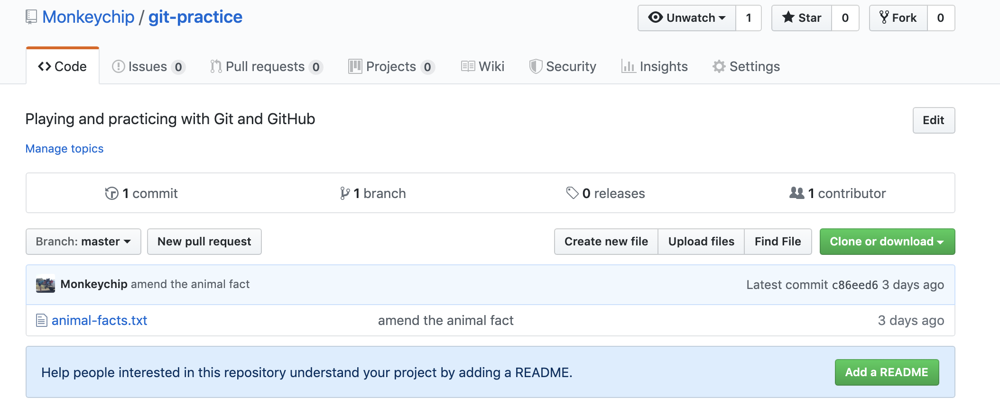

# Day 29 - Introduction to GitHub

GitHub is the single largest host for Git repositories.  Git repositories, if you remember, are projects (e.g., folders, directories) that are managed by Git's version control.  You created a Git repository in yesterday's blog post.

#### Exercise: Pushing your Git Repository to GitHub

To help us understand how Git and GitHub work together, we're going to connect our Git repository ("git-practice") to our GitHub account.

1\. Make sure you've done the exercise in yesterday's blog article.  You should have a folder in your downloads folder called "git-practice" that is now being watched by Git (you did this by running the `git init` command).

2\. In your terminal, make sure you are on your Git repository called "git-practice."

You can confirm by using the "print-working-directory" command. Notice, I'm located in the "git-practice" folder.


3\. Next, we're going to confirm that we have connected our GitHub account correctly to Git.  You would have done this in yesterday's article when you set up your Git account.

To confirm that this looks correct, let's quickly check out out `git global config` file. To look at this file, run: `git config --global --list` 


Once you enter this command, Git will list what's in your Git config file.  You can see in my `git global config` file that I have my GitHub username Monkeychip and my email address (I have blurred this out).

What is important, is that your user.name and user.email match your GitHub account.

If your user.name and user.email do not match your GitHub account information follow these instructions for setting up your Git [username](https://help.github.com/en/articles/setting-your-username-in-git), and here for your Git [email](https://help.github.com/en/articles/setting-your-commit-email-address-in-git).

4\. The next step is to create a new repository on our GitHub account that we can use to connect our Git repository to.

On your GitHub account, navigate to the "Repository" tab, and click "New." Name the repository - you can name it whatever you'd like - and use the default settings.


Once created, GitHub helps you by providing the commands you'll need.  We are going to use the commands under "or push existing repository from command line."

I have copy-pasted the commands GitHub provides below.

```
git remote add origin https://github.com/replace-with-your-username/replace-with-your-git-repo-name.git
git push -u origin master
```


The first command connects your Git repository to the GitHub repository you just created.  Without getting into too many details, which we don't have time for here, this commands adds a remote repository called "origin."  Origin is pointing at the GitHub repository you just made (see the URL).

The second command "pushes" (a Git term to more or less indicate saving your project) to the "master" branch. 

I>Branching is not something we have time to go into in this blog post, but it's helpful to think of branches as different versions of a project.  Master is a branch that Git automatically creates.  You can then make other branches if you'd like and call them something like "bug-fix" or "test-text-change."  Branching is a topic you'll need to explore more.

A lot is going on in these two commands.  In summary, these two commands you have connected your Git and GitHub repositories.  Now your "git-practice" project on your computer is connected to your "git-practice" repository on GitHub.

5\. Go ahead and refresh the GitHub repository you created on GitHub.  You should see the "git-practice" folder and file on the GitHub.  Nice work!



Now, whenever you make a change to a file in your "git-practice" folder, you can add, commit, and then push that change to GitHub. Again, this is all a little much to grasp here fully, and you'll want to spend more time practicing this workflow.  My point in this exercise was to introduce you to part of the process and get you set up with Git and GitHub.

Before we wrap up today, I want to briefly talk about GitHub as an asset when applying to Web Developer positions.

### GitHub: the new resume

Your GitHub activity, profile, and repositories will be much more valuable to any prospective employer than your resume.  It's also likely that any project you take as part of the application process will be done using the Git / GitHub workflow.

Employers will use your GitHub profile to determine: what if any repositories you are contributing to, what repositories you have made yourself, and if you are actively using Git.  In the programming world, it's less about what school you went to, and more about what you've created or are contributing to.  If you have an active presence in the GitHub community, your future employer will be sure to take notice.  

#### Tomorrow is our last day!

We've covered a lot, and if you're a bit overwhelmed, you're not alone. Getting starting in Web Development, knowing how to focus and spend your energy studying the right things, is challenging.  I wrote the book "How to Become a Web Developer: A Field Guide" because I wanted to write the book I needed when I first started.  I wanted to give a field guide for how to navigate all this information.

In the last blog post, I'll introduce a printable Field Guide that maps out a path for you to travel.  Hopefully, it will provide you some sense of what to do with the information you've learned in these articles and your next steps.

